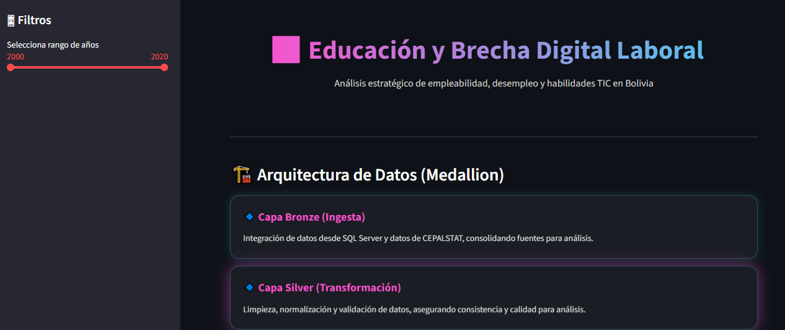
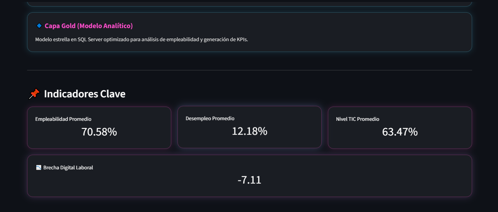
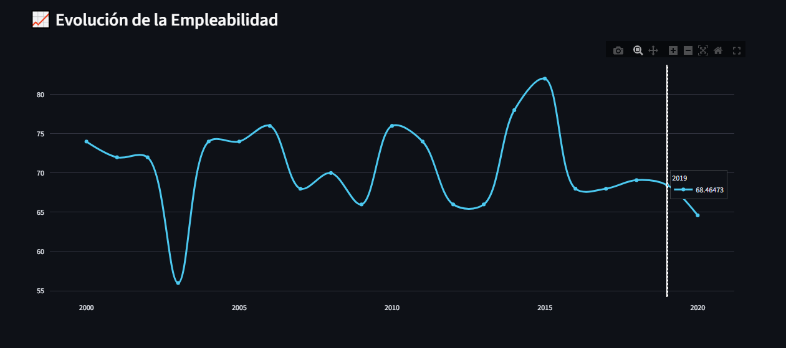
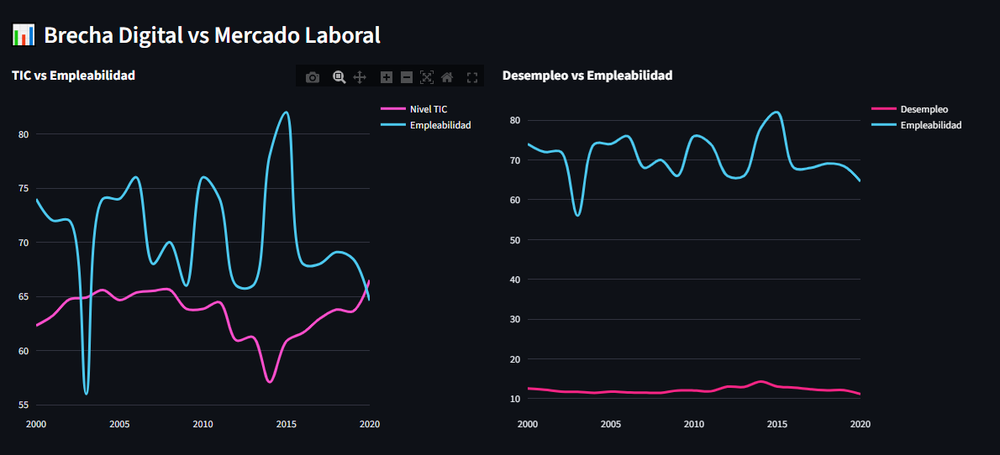
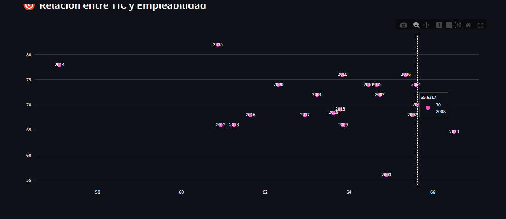
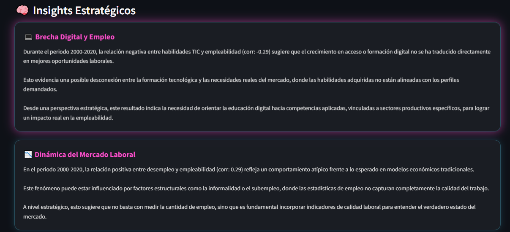
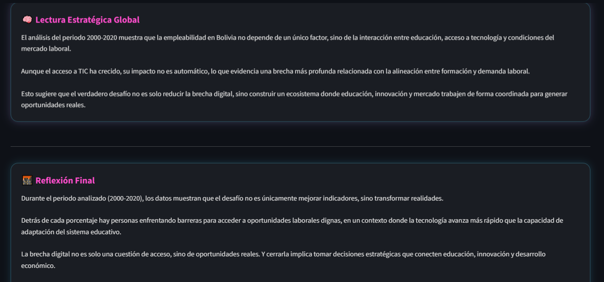

# 📊 BI: Educación y Brecha Digital Laboral en Bolivia

## 🎯 Objetivo
Analizar la relación entre habilidades digitales (TIC), desempleo y empleabilidad en Bolivia mediante un sistema de Inteligencia de Negocios.

## 🏗️ Arquitectura
- Bronze: Ingesta de datos (SQL Server + CEPAL)
- Silver: Limpieza y validación (Python)
- Gold: Modelo estrella (SQL Server)

## 📊 Dashboard
Desarrollado en Streamlit con:
- KPIs estratégicos
- Filtros dinámicos
- Visualizaciones interactivas
- Insights automáticos

## 🌍 ODS
- ODS 4: Educación de calidad
- ODS 8: Trabajo decente

## 🚀 Tecnologías
- SQL Server
- Python (Pandas, PyODBC)
- Streamlit
- Plotly

## 👥 Equipo
- Sergio Alberto Tavera Gandarillas

## 📸 Evidencia

### 🔹 Vista General del Dashboard

### 🔹 KPIs Estratégicos

### 🔹 Evolución de la Empleabilidad

### 🔹 Brecha digital vs Mercado Laboral

### 🔹 Relacion entre TIC y Empleabilidad

### 🔹 Insights Estratégicos

### 🔹 Reflexion Final
